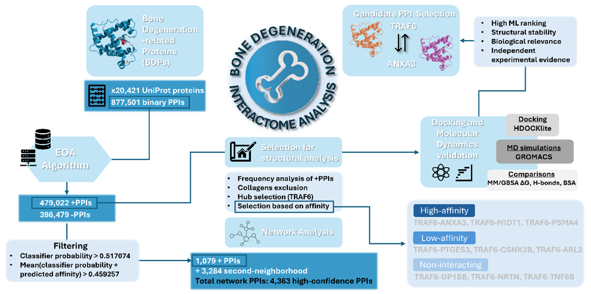

# Bone Interactome Analysis

This repository contains the necessary codes and datasets for replicating the computational reconstruction and analysis of a **bone degeneration-related protein–protein interaction (PPI) network**, and a subsequent Molecular Dynamics analysis of selected targets. The whole analysis workflow is summarized on the figure below.

 
* Workflow Figure : Overview of the bone degeneration-related (BDP) interactome analysis workflow. Overall workflow for EOA-based prediction of BDP protein-protein interactions (PPIs), network reconstruction, candidate PPI prioritization, and molecular dynamics (MD) validation. A curated set of BDPs was combined with 20,421 reviewed human UniProt proteins to generate 877,501 candidate PPIs, which were classified by the EOA-based ML pipeline into predicted positive and negative interactions. Positive (predicted interacting) PPIs were filtered based on classifier probability and predicted affinity, yielding 4,363 PPIs for network reconstruction, clustering, and per-cluster functional analysis. For the structural analysis, TRAF6 was selected as a central node, and representative high-scoring, low-scoring, and non-interacting TRAF6-involving PPIs were selected for docking and MD simulations. Comparative analysis of the selected interactions prioritized the TRAF6-ANXA3 PPIs for extended MD characterization.*

> [!NOTE]
> This repository is organized into two main parts:
>
> **Part 1 — Bone EOA Analysis**  
> EOA-based PPI prediction, network reconstruction, clustering, network analytics, and functional enrichment.
>
> **Part 2 — Molecular Dynamics Analysis**

> [!IMPORTANT]
> Several large datasets and the Cytoscape project file are intentionally excluded from GitHub and are provided separately through Google Drive. See [Large Files and Datasets](#large-files-and-datasets).

---

# Contents

- [Part 1 — Bone EOA Analysis](#part-1--bone-eoa-analysis)
  - [Part 1 Overview](#part-1-overview)
  - [Part 1 Workflow](#part-1-workflow)
  - [1.1 Initial Bone Protein Dataset](#11-initial-bone-protein-dataset)
  - [1.2 Candidate Bone PPI Generation](#12-candidate-bone-ppi-generation)
  - [1.3 PPI Feature Calculation](#13-ppi-feature-calculation)
  - [1.4 EOA Classification and Regression](#14-eoa-classification-and-regression)
  - [1.5 Positive PPI Detection and Filtering](#15-positive-ppi-detection-and-filtering)
  - [1.6 OP-Interactor Expansion](#16-op-interactor-expansion)
  - [1.7 Interaction Mapping and Annotation](#17-interaction-mapping-and-annotation)
  - [1.8 Final Bone PPI Network](#18-final-bone-ppi-network)
  - [1.9 Network Reconstruction and Clustering](#19-network-reconstruction-and-clustering)
  - [1.10 Network Analytics](#110-network-analytics)
  - [1.11 Functional Enrichment Analysis](#111-functional-enrichment-analysis)
  - [Part 1 Dataset Summary](#part-1-dataset-summary)
  - [Part 1 Dataset Columns](#part-1-dataset-columns)
  - [Part 1 Repository Structure](#part-1-repository-structure)
- [Part 2 — Molecular Dynamics Analysis](#part-2--molecular-dynamics-analysis)
- [Large Files and Datasets](#large-files-and-datasets)
- [Reproducing the Analysis](#reproducing-the-analysis)
- [Acknowledgements](#acknowledgements)

---

# Part 1 — Bone EOA Analysis

<a id="part-1-overview"></a>

## Part 1 Overview

Part 1 reconstructs a bone degeneration-related protein interaction network starting from a curated set of **44 Osteoporosis-related Proteins (OPs)**.

### Part 1 at a Glance

| Analysis stage | Result |
|---|---:|
| Osteoporosis-related Proteins | **44** |
| Reviewed human UniProt entries | **20,421** |
| Candidate OP PPIs | **877,501** |
| EOA-positive OP PPIs | **479,022** |
| Filtered high-confidence OP PPIs | **1,079** |
| Identified OP interactors | **995** |
| Candidate OP-interactor combinations | **494,515** |
| EOA-positive interactor PPIs | **46,722** |
| Filtered high-confidence interactor PPIs | **3,284** |
| **Final PPI network** | **4,363 PPIs** |

---

## Part 1 Workflow

```text
44 Osteoporosis-related Proteins
                │
                ▼
20,421 reviewed human UniProt proteins
                │
                ▼
Generation of candidate OP–human PPIs
                │
                ▼
877,501 candidate OP PPIs
                │
                ▼
PPI feature calculation
                │
                ▼
EOA classification + regression
                │
                ▼
479,022 predicted positive PPIs
                │
                ▼
Dual confidence filtering
Probability Score > 0.517074
AND
mean_prob_aff > 0.459257
                │
                ▼
1,079 high-confidence OP PPIs
                │
                ▼
995 OP interactors
                │
                ▼
494,515 candidate interactor combinations
                │
                ▼
PPI feature calculation
                │
                ▼
EOA classification + regression
                │
                ▼
46,722 predicted positive PPIs
                │
                ▼
Same dual confidence filtering
                │
                ▼
3,284 high-confidence interactor PPIs
                │
                ▼
1,079 + 3,284
                │
                ▼
4,363 final PPIs
                │
                ▼
STRING DB / iRefIndex / Gene / OP mapping
                │
                ▼
Cytoscape network reconstruction
                │
                ▼
MCL / MCODE / Leiden / GLay comparison
                │
                ▼
MCL granularity 4
                │
                ▼
Network analytics
                │
                ▼
Functional enrichment analysis
```

---

## 1.1 Initial Bone Protein Dataset

The analysis starts from a curated list of **44 Osteoporosis-related Proteins (OPs)**.

The corresponding reference dataset is:

```text
bone_EOA_analysis/Datasets/reference/bone_proteins_04.xlsx
```

The dataset contains the selected protein names and their corresponding UniProt identifiers.

These proteins form the biological starting point for reconstruction of the bone-related interaction network.

The OP list was combined with **20,421 reviewed human UniProt entries**, corresponding to the reviewed human proteome used in the analysis as of **December 2024**.

---

## 1.2 Candidate Bone PPI Generation

The 44 OPs were combined with the reviewed human UniProt entries to construct the initial candidate PPI space.

This generated:

> **877,501 candidate OP-associated PPIs**

The corresponding combination dataset is:

```text
bone_EOA_analysis/Datasets/reference/bone_comb.csv
```

Each pair represents a potential binary PPI containing at least one protein from the curated OP list.

These candidate pairs were subsequently subjected to PPI feature calculation.

---

## 1.3 PPI Feature Calculation

The candidate protein pairs were transformed into feature-based representations suitable for EOA PPI prediction.

The feature-calculation methodology follows the workflow implemented in the external **TR-PPI project**:

### [TR-PPI — PPI Feature Calculation Workflow](https://github.com/HarrisZavs/TR_PPI/tree/main)

The feature calculation expands each protein pair with sequence-derived, physicochemical, functional, evolutionary, expression, localization, and interaction-database-related characteristics.

### Main Input Fields

The protein-pair input contains:

```text
uidA
uidB
protein_accession_A
protein_accession_B
seq_A
seq_B
```

### Feature Categories

Calculated features include:

#### Sequence Similarity

```text
Sequence_similarity
```

#### Amino-Acid Composition

```text
A %, L %, F %, I %, M %, V %, S %, P %, T %, Y %, H %, Q %, N %, K %, D %, E %, C %, W %, R %, G %
```

#### Physicochemical Differences

```text
MW dif, Aromaticity dif, Instability dif, helix_fraction_dif, turn_fraction_dif, sheet_fraction_dif, cys_reduced_dif, cys_residues_dif, gravy_dif, ph7_charge_dif
```

#### Gene Ontology Similarity

```text
BP_similarity
MF_similarity
CC_similarity
```

representing similarity in:

- Biological Process;
- Molecular Function; and
- Cellular Component.

#### Additional Interaction-Related Features

```text
pfam_interaction, Subcellular Co-localization?, GSE227375_spearman, GSE228702_spearman, Homologous in Mouse, Homologous in Drosophila, Homologous in Yeast, Homologous in Ecoli, Exists in MINT?, Exists in DIP?, Exists in APID?, Exists in BIOGRID?
```

The complete feature-calculated datasets contain **67 columns**.

### Feature-Calculated Datasets

```text
Datasets/feature_calculated/
├── bone_PPI_combs_raw.csv
├── bone_PPI_combs_processed.csv
├── bone_interactor_combs_raw.csv
└── bone_interactor_combs_processed.csv
```

The OP datasets contain:

> **877,501 PPIs**

while the interactor datasets contain:

> **494,515 candidate PPIs**

> [!NOTE]
> Files ending in `_raw` contain the unprocessed calculated features.
>
> Files ending in `_processed` contain the preprocessing used for EOA prediction, including **KNN imputation** and **arithmetic sample-wise normalization**.

The feature-calculated files are several hundred MB to several GB each and are therefore distributed through the external large-file archive rather than GitHub.

---

## 1.4 EOA Classification and Regression

Candidate PPIs were evaluated using an **Evolutionary Optimization Algorithm (EOA)-based methodology** combining classification and regression.

The prediction code and trained model files are located under:

```text
bone_EOA_analysis/fc_EOA_prediction_codes/
```

including the main classification/regression prediction implementation and the required trained models.

### Classification

The classifier assigns each candidate PPI a predicted interaction class:

```text
Predicted Classes
```

where:

| Value | Interpretation |
|---:|---|
| `0` | Predicted negative interaction |
| `1` | Predicted positive interaction |

The classifier additionally produces:

```text
Probability Score
```

representing the classifier's prediction probability.

### Regression

The regression model generates:

```text
Regression Value
```

representing the predicted interaction-affinity component of the EOA methodology.

### Combined Confidence Score

Classifier and regression information are combined into:

```text
mean_prob_aff
```

which is used together with the classification probability to rank and filter candidate PPIs.

---

## 1.5 Positive PPI Detection and Filtering

### Initial OP PPI Predictions

From the original:

> **877,501 candidate OP PPIs**

the EOA classifier identified:

> **479,022 predicted positive interactions**


### Final Filtering Strategy

> [!IMPORTANT]
> **Both confidence filters were required simultaneously:**
>
> **Probability Score > 0.517074**
>
> **AND**
>
> **mean_prob_aff > 0.459257**

Applying both filters reduced the original 479,022 predicted positive interactions to:

> **1,079 high-confidence OP PPIs**

The final filtered dataset is:

```text
Datasets/results/
BOTH_FILTER_bone_ppis_EOA_positive_fully_mapped.csv
```

---

## 1.6 OP-Interactor Expansion

The filtered 1,079 OP PPIs contained:

> **995 OP-interacting proteins**

These interactors were used to construct a second candidate interaction space representing potential PPIs among proteins associated with the original OP-centered network.

This generated:

> **494,515 candidate interactor combinations**

Following feature calculation and EOA analysis:

> **46,722 interactions were classified as positive**

The same dual confidence criteria were applied:

```text
Probability Score > 0.517074
AND
mean_prob_aff > 0.459257
```

This resulted in:

> **3,284 high-confidence OP-interactor PPIs**

The corresponding final filtered dataset is:

```text
Datasets/results/
BOTH_FILTER_bone_interactor_combs_EOA_positive_fully_mapped.csv
```

---

## 1.7 Interaction Mapping and Annotation

EOA predictions were subsequently mapped against external interaction databases and biological identifiers.

The mapping code is located under:

```text
bone_EOA_analysis/mapping_codes/
```

and includes separate mapping workflows for the original OP PPIs and the OP-interactor combinations.

### Reference Datasets

```text
Datasets/reference/
├── bone_proteins_04.xlsx
├── bone_comb.csv
├── uid_to_Gene_Names.csv
├── irefindex_v3.csv
└── stringdb_ppis_curated.csv
```

---

### STRING DB Mapping

`stringdb_ppis_curated.csv` contains curated human binary PPIs from **STRING DB v12.0**, using the database snapshot used in this analysis.

The dataset was filtered to retain interactions where both interaction partners could be mapped to UniProt identifiers.

Important columns include:

| Column | Description |
|---|---|
| `string_A` | STRING identifier of protein A |
| `string_B` | STRING identifier of protein B |
| `score` | STRING interaction score |
| `uidA` | UniProt ID of protein A |
| `uidB` | UniProt ID of protein B |
| `score_norm` | STRING interaction score normalized to a 0–1 range |

The mapping generates:

```text
stringdb_check
score_norm
```

where `stringdb_check` indicates whether a predicted PPI occurs in the curated STRING reference dataset.

---

### iRefIndex Mapping

The dataset:

```text
irefindex_v3.csv
```

contains filtered human binary PPIs represented using UniProt identifiers.

The mapping adds:

```text
irefindex_check
uidA_irefindex
uidB_irefindex
method
Host_organism_taxid
numParticipants
```

where available.

---

### UniProt-to-Gene Mapping

The dataset:

```text
uid_to_Gene_Names.csv
```

maps UniProt IDs to their corresponding gene names.

This generates:

```text
GeneA
GeneB
```

for each PPI.

---

### OP Annotation

The original OP list is used to assign:

```text
OP_A
OP_B
OP_check
```

to each interaction.

`OP_A` and `OP_B` indicate whether each individual protein belongs to the original curated OP set.

---

## 1.8 Final Bone PPI Network

The two high-confidence interaction populations were combined:

```text
1,079 high-confidence OP PPIs
+
3,284 high-confidence interactor PPIs
=
4,363 final PPIs
```

The resulting network dataset is:

```text
Datasets/results/final_bone_ppi_network_file.csv
```

and contains:

> **4,363 PPIs**

### `OP_check`

The `OP_check` column distinguishes the two interaction classes in the final network.

| OP_check | Meaning |
|---:|---|
| `1` | At least one protein belongs to the original OP set |
| `0` | Interaction originates from the OP-interactor expansion |

### Complete EOA Result Datasets

The complete mapped predictions are:

```text
bone_ppis_EOA_all_predictions_mapped.csv
bone_interactor_combs_EOA_all_predictions_mapped.csv
```

These contain EOA predictions and mapping information for all **877,501** and **494,515** candidate interactions, respectively.

---

## 1.9 Network Reconstruction and Clustering

The final 4,363-PPI network was reconstructed and visualized using:

> **Cytoscape v3.10.1**

Multiple network-clustering algorithms and parameter configurations were evaluated.

### Tested Clustering Configurations

| Algorithm | Configuration |
|---|---|
| MCL | Granularity 4 |
| MCL | Granularity 2.5 |
| MCL | Granularity 2 |
| MCODE | Degree coefficient 3 |
| MCODE | Degree coefficient 2 |
| Leiden | Resolution 0.1 |
| Leiden | Resolution 0.05 |
| GLay | Default configuration |

For MCODE, the tested workflow additionally included:

```text
Node score cutoff: 0.3
k-core: 2
Max depth: 200
```

with haircut/fluff settings evaluated during clustering.

### Network-Level Clustering Comparison

| Algorithm | Configuration | Clustering Coefficient | Density | Heterogeneity | Degree | Silhouette Coefficient |
|---|---|---:|---:|---:|---:|---:|
| MCL | Gran. 4 | 0.263 | **0.741** | 2.025 | 2.506 | **0.586** |
| MCL | Gran. 2.5 | 0.304 | 0.706 | 2.406 | 2.899 | 0.520 |
| MCL | Gran. 2 | 0.408 | 0.491 | 2.540 | 3.980 | 0.409 |
| MCODE | DC 3 | 0.660 | 0.660 | 0.910 | 3.070 | 0.388 |
| MCODE | DC 2 | 0.270 | 0.193 | 1.599 | 3.091 | 0.345 |
| Leiden | Res. 0.1 | 0.264 | 0.504 | 2.560 | 3.141 | **0.595** |
| Leiden | Res. 0.05 | 0.310 | 0.424 | 2.677 | 3.731 | 0.553 |
| GLay | Default | 0.462 | 0.127 | 1.782 | 5.416 | 0.451 |


> [!NOTE]
> **MCL with granularity 4** was selected for downstream network interpretation because it provided a strong combination of cluster separation and internal network density.


---

## 1.10 Network Analytics

Network topology and clustering quality were further evaluated using Cytoscape-exported attributes and Python-based analysis.

Network-analysis code and results are located under:

```text
bone_EOA_analysis/network_reconstruction/network_analytics/
```

The analysis includes:

- degree;
- density;
- clustering coefficient;
- betweenness centrality;
- closeness centrality;
- cluster-level density;
- cluster inertia; and
- cluster separation.

Node2Vec embeddings were additionally used to assess cluster separation through silhouette scoring based on the Cytoscape-generated cluster assignments.

### Example Cluster-Level Results for the Selected MCL Network

| MCL Cluster | Nodes | Edges | Density | Silhouette |
|---:|---:|---:|---:|---:|
| 40 | 3 | 3 | 1.000 | 1.000 |
| 30 | 6 | 5 | 0.333 | 0.345 |
| 32 | 6 | 11 | 0.733 | 0.187 |
| 16 | 16 | 33 | 0.275 | 0.047 |
| 18 | 15 | 54 | 0.514 | 0.041 |
| 11 | 22 | 74 | 0.320 | 0.030 |

Network-analysis outputs include node-level and edge-level statistics for the tested network configurations.

---

## 1.11 Functional Enrichment Analysis

Functional enrichment analysis was performed on clusters derived from the selected:

> **MCL granularity-4 network**

The corresponding analysis code, result tables, and figures are located under:

```text
bone_EOA_analysis/
network_reconstruction/
MCL_gran_4_cluster_enrichment/
```

The analyses include:

- Gene Ontology enrichment;
- Biological Process enrichment;
- Molecular Function enrichment;
- Cellular Component enrichment;
- protein-group enrichment;
- human-background enrichment;
- custom-background enrichment; and
- CORUM-related enrichment.

Where applicable, statistically significant enrichment was defined using:

```text
Adjusted P-value < 0.05
```

The downstream interpretation focused on clusters meeting the relevant network-quality and biological-selection criteria.

Examples of significantly enriched clusters include clusters associated with:

- sensory and olfactory-related biological processes;
- olfactory receptor activity;
- purine ribonucleotide activity;
- adenyl nucleotide binding;
- ATP/GTP-related functions;
- transcription-regulator complex formation; and
- histone acetyltransferase activity.

---

## Part 1 Dataset Summary

| Dataset | Rows | Description | GitHub |
|---|---:|---|---|
| `bone_comb.csv` | 877,501 | Initial OP–human candidate combinations | Included |
| `bone_PPI_combs_raw.csv` | 877,501 | Raw calculated OP PPI features | Google Drive |
| `bone_PPI_combs_processed.csv` | 877,501 | Processed OP PPI features | Google Drive |
| `bone_interactor_combs_raw.csv` | 494,515 | Raw interactor-combination features | Google Drive |
| `bone_interactor_combs_processed.csv` | 494,515 | Processed interactor-combination features | Google Drive |
| `stringdb_ppis_curated.csv` | 13,715,404 | Curated STRING DB reference interactions | Google Drive |
| `bone_ppis_EOA_all_predictions_mapped.csv` | 877,501 | Complete mapped OP PPI predictions | Google Drive |
| `bone_interactor_combs_EOA_all_predictions_mapped.csv` | 494,515 | Complete mapped interactor predictions | Included |
| `BOTH_FILTER_bone_ppis_EOA_positive_fully_mapped.csv` | 1,079 | Final filtered OP PPIs | Included |
| `BOTH_FILTER_bone_interactor_combs_EOA_positive_fully_mapped.csv` | 3,284 | Final filtered interactor PPIs | Included |
| `final_bone_ppi_network_file.csv` | **4,363** | **Final PPI network** | **Included** |

---

## Part 1 Dataset Columns

The fully mapped EOA datasets contain the following main variables.

### PPI Identification

| Column | Description |
|---|---|
| `uidA` | UniProt ID of protein A |
| `uidB` | UniProt ID of protein B |

### EOA Predictions

| Column | Description |
|---|---|
| `Predicted Classes` | Binary EOA prediction: `0` negative, `1` positive |
| `Probability Score` | Classifier prediction probability |
| `Regression Value` | Predicted interaction-affinity score |
| `mean_prob_aff` | Combined classifier/regression score |

### STRING DB Annotation

| Column | Description |
|---|---|
| `stringdb_check` | Indicates whether the PPI occurs in the curated STRING dataset |
| `score_norm` | Normalized STRING interaction score |

### iRefIndex Annotation

| Column | Description |
|---|---|
| `irefindex_check` | Indicates whether the PPI occurs in iRefIndex |
| `uidA_irefindex` | UniProt identifier of protein A in iRefIndex |
| `uidB_irefindex` | UniProt identifier of protein B in iRefIndex |
| `method` | Experimental interaction-detection method |
| `Host_organism_taxid` | Host organism information |
| `numParticipants` | Number of proteins participating in the interaction |

### Gene Annotation

| Column | Description |
|---|---|
| `GeneA` | Gene name corresponding to protein A |
| `GeneB` | Gene name corresponding to protein B |

### OP Annotation

| Column | Description |
|---|---|
| `OP_A` | Indicates whether protein A belongs to the OP set |
| `OP_B` | Indicates whether protein B belongs to the OP set |
| `OP_check` | Distinguishes original OP-centered PPIs from interactor-expansion PPIs |

---

## Part 1 Repository Structure

```text
bone_EOA_analysis/
│
├── Datasets/
│   │
│   ├── reference/
│   │   ├── bone_proteins_04.xlsx
│   │   ├── bone_comb.csv
│   │   ├── uid_to_Gene_Names.csv
│   │   ├── irefindex_v3.csv
│   │   └── stringdb_ppis_curated.csv           [Google Drive]
│   │
│   ├── feature_calculated/                     [Google Drive]
│   │   ├── bone_PPI_combs_raw.csv
│   │   ├── bone_PPI_combs_processed.csv
│   │   ├── bone_interactor_combs_raw.csv
│   │   └── bone_interactor_combs_processed.csv
│   │
│   ├── intermediate/                           [Google Drive]
│   │   └── intermediate prediction and mapping datasets
│   │
│   └── results/
│       ├── bone_ppis_EOA_all_predictions_mapped.csv
│       │                                      [Google Drive]
│       ├── bone_interactor_combs_EOA_all_predictions_mapped.csv
│       ├── BOTH_FILTER_bone_ppis_EOA_positive_fully_mapped.csv
│       ├── BOTH_FILTER_bone_interactor_combs_EOA_positive_fully_mapped.csv
│       └── final_bone_ppi_network_file.csv
│
├── fc_EOA_prediction_codes/
│   ├── CLASS_AND_REGRESSION_PREDICTION_NEW.py
│   ├── mappings.py
│   └── models/
│
├── mapping_codes/
│   ├── bone_ppi_mappings.ipynb
│   └── bone_interactor_combs_mappings.ipynb
│
└── network_reconstruction/
    │
    ├── bone_network.cys                        [Google Drive]
    │
    ├── network figures
    │
    ├── network_analytics/
    │   ├── codes/
    │   └── network-analysis outputs
    │
    └── MCL_gran_4_cluster_enrichment/
        ├── codes/
        ├── human_background/
        ├── custom_background/
        ├── protein_group__enrichment_results/
        ├── corum_enrichment_results/
        └── plots/
```

---

# Part 2 — Molecular Dynamics Analysis

> [!NOTE]
> **Part 2 — Molecular Dynamics Analysis**

---

# Large Files and Datasets

Large files required for the complete analysis are available separately through the following Google Drive link:

## [Google Drive — Bone Interactome Large Files](https://drive.google.com/drive/folders/1kHUdZrQVWlmVUzE0BSwz7oyl62Y7vfhe?usp=sharing)

> [!WARNING]
> Large feature matrices, intermediate datasets, the complete STRING reference dataset, selected complete EOA prediction outputs, and the Cytoscape project file (that contains the reconstructed network) are excluded from GitHub.
>
> Download these files from the Google Drive archive and restore them to the corresponding locations shown below.

### Recommended Google Drive Structure

```text
bone_interactome_analysis_large_files/
│
├── Part_1_Bone_EOA/
│   │
│   ├── feature_calculated/
│   │   ├── bone_PPI_combs_raw.csv
│   │   ├── bone_PPI_combs_processed.csv
│   │   ├── bone_interactor_combs_raw.csv
│   │   └── bone_interactor_combs_processed.csv
│   │
│   ├── intermediate/
│   │   └── intermediate prediction/mapping datasets
│   │
│   ├── reference/
│   │   └── stringdb_ppis_curated.csv
│   │
│   ├── results/
│   │   └── bone_ppis_EOA_all_predictions_mapped.csv
│   │
│   └── cytoscape/
│       └── bone_network.cys
│
└── Part_2_Molecular_Dynamics/
```

### Restore Locations

| Google Drive folder | Repository destination |
|---|---|
| `Part_1_Bone_EOA/feature_calculated/` | `bone_EOA_analysis/Datasets/feature_calculated/` |
| `Part_1_Bone_EOA/intermediate/` | `bone_EOA_analysis/Datasets/intermediate/` |
| `Part_1_Bone_EOA/reference/` | `bone_EOA_analysis/Datasets/reference/` |
| `Part_1_Bone_EOA/results/` | `bone_EOA_analysis/Datasets/results/` |
| `Part_1_Bone_EOA/cytoscape/` | `bone_EOA_analysis/network_reconstruction/` |

### Large Part 1 Files Excluded from GitHub

#### Feature-Calculated Datasets

```text
bone_PPI_combs_processed.csv
bone_PPI_combs_raw.csv
bone_interactor_combs_processed.csv
bone_interactor_combs_raw.csv
```

These contain the complete 67-column feature representations used for EOA prediction.

#### Intermediate Datasets

The complete contents of:

```text
Datasets/intermediate/
```

including classification, regression, filtering, pair-generation, and mapping intermediates.

Examples include:

```text
bone_interactor_combs_regression_predictions.csv
bone_ppis_predictions.csv
bone_ppis_EOA_predictions.csv
bone_interactor_combs_positives.csv
BOTH_FILTER_OP_interactor_combs_MAPPED.csv
BOTH_FILTER_OP_interactor_ids.csv
```

#### Large Reference Dataset

```text
stringdb_ppis_curated.csv
```

This contains approximately:

> **13.7 million curated STRING DB PPI records**

and is approximately 1 GB.

#### Complete OP Prediction Dataset

```text
bone_ppis_EOA_all_predictions_mapped.csv
```

This contains mapped predictions for all:

> **877,501 candidate OP PPIs**

#### Cytoscape Project

```text
bone_network.cys
```

This is the Cytoscape project containing the reconstructed network and Cytoscape session information.

> [!TIP]
> Preserve the directory structure when downloading the large-file archive. This makes it straightforward to restore the files to the locations expected by the analysis workflow.

---

# Reproducing the Analysis

## Part 1 — Bone EOA Analysis

### Step 1 — Prepare the Candidate OP PPI Dataset

Start with:

```text
Datasets/reference/bone_proteins_04.xlsx
Datasets/reference/bone_comb.csv
```

representing the 44 OPs and their candidate interactions with the reviewed human proteome.

---

### Step 2 — Calculate PPI Features

Use the methodology described in:

### [TR-PPI Feature Calculation Repository](https://github.com/HarrisZavs/TR_PPI/tree/main)

to generate the raw and processed feature matrices.

Expected outputs:

```text
bone_PPI_combs_raw.csv
bone_PPI_combs_processed.csv
```

---

### Step 3 — Perform EOA Classification and Regression

Use:

```text
bone_EOA_analysis/fc_EOA_prediction_codes/
```

together with the included model files to generate:

```text
Predicted Classes
Probability Score
Regression Value
mean_prob_aff
```

---

### Step 4 — Apply the High-Confidence Filters

Retain interactions satisfying:

```text
Probability Score > 0.517074
AND
mean_prob_aff > 0.459257
```

Expected result:

> **1,079 OP PPIs**

---

### Step 5 — Generate the OP-Interactor Candidate Space

Use the interactors identified from the filtered OP network to construct:

> **494,515 candidate interactor PPIs**

Calculate their corresponding features and apply the same EOA prediction workflow.

---

### Step 6 — Filter the Interactor Predictions

Apply the same thresholds:

```text
Probability Score > 0.517074
AND
mean_prob_aff > 0.459257
```

Expected result:

> **3,284 high-confidence interactor PPIs**

---

### Step 7 — Map the Interactions

Use:

```text
bone_EOA_analysis/mapping_codes/
```

with:

```text
stringdb_ppis_curated.csv
irefindex_v3.csv
uid_to_Gene_Names.csv
bone_proteins_04.xlsx
```

to generate STRING, iRefIndex, gene, and OP annotations.

---

### Step 8 — Construct the Final Network

Combine:

```text
1,079 OP PPIs
+
3,284 interactor PPIs
```

to obtain:

> **4,363 final PPIs**

stored in:

```text
Datasets/results/final_bone_ppi_network_file.csv
```

---

### Step 9 — Reconstruct and Cluster the Network

Import the final interaction dataset into Cytoscape and evaluate:

```text
MCL
MCODE
Leiden
GLay
```

The selected clustering solution is:

> **MCL — granularity 4**

---

### Step 10 — Perform Network Analytics

Use:

```text
network_reconstruction/network_analytics/
```

to evaluate network and cluster topology.

---

### Step 11 — Perform Functional Enrichment

Use:

```text
network_reconstruction/MCL_gran_4_cluster_enrichment/
```

for GO, protein-group, custom-background, human-background, and CORUM-related enrichment analyses.

---

## Part 2 — Molecular Dynamics Analysis

---

# Acknowledgements

The present work has been developed as part of the **REGENERATION project**, funded by the European Union’s Horizon 2020 research and innovation program under the **Marie Sklodowska-Curie RISE (Grant Agreement No. 101131255)**.


This work was supported by the **Swiss State Secretariat for Education, Research and Innovation (SERI)** under contract number **23.0086**.
